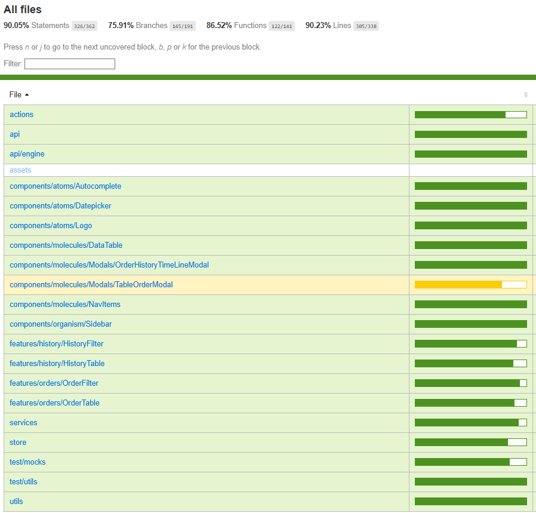
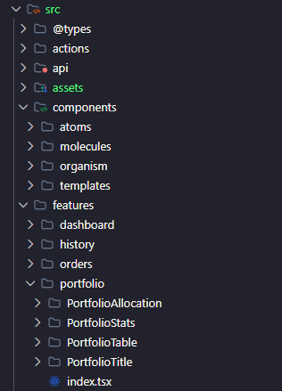
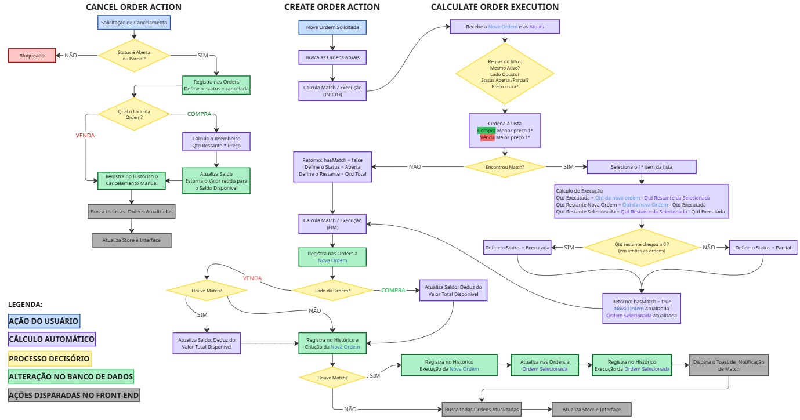
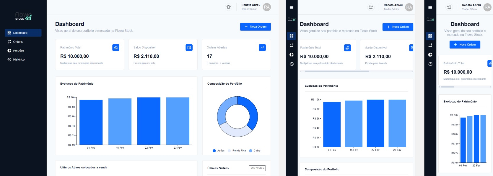

<h1 align="center">
    Flowa Stock 📈
</h1>

<p align="center">
 <a href="#-sobre-o-projeto">Descrição</a> •
 <a href="#-tecnologias">Tecnologias</a> • 
 <a href="#-como-executar-o-projeto">Como executar</a> •
 <a href="#-testes-automatizados">Testes Automatizados</a> •
 <a href="#-arquitetura">Arquitetura</a> •
 <a href="#-preview">Preview</a>
</p>

## 💻 Descrição

O Flowa Stock é uma plataforma completa para gerenciamento e negociação de ativos financeiros desenvolvida em Javascript com o superset Typescript. Além do controle de ordens, o sistema oferece dashboards intuitivos, alocação de ativos, histórico detalhado de eventos e geração de relatórios.

## 🛠 Tecnologias

As seguintes ferramentas foram usadas na construção do projeto:

#### **Principais bibliotecas** ([React (TS) + Vite](https://vite.dev/))

##### Estilização
- **[Material UI (Icons-DatePicker-Charts)](https://mui.com/)**
- **[React-toastify](https://fkhadra.github.io/react-toastify/introduction)**

##### Utilitários
- **[JSON-Server](https://github.com/typicode/json-server)**
- **[DayJS](https://day.js.org/docs/en/installation/installation)**
- **[React Hook Form](https://react-hook-form.com/)**
- **[Zod](https://zod.dev/)**
- **[Zustand](https://zustand-demo.pmnd.rs/)**
- **[Tanstack/react-router](https://tanstack.com/router/latest)**

##### Padronização de código
- **[Husky](https://typicode.github.io/husky/)**
- **[Prettier](https://prettier.io/docs/)**
- **[Lint-staged](https://github.com/lint-staged/lint-staged)**

##### Testes Automatizados
- **[Vitest](https://vitest.dev/)**
- **[Msw](https://mswjs.io/)**

> Veja o arquivo completo: [package.json](https://github.com/RenatoAlbuquerque/coodesh-flowa/blob/main/package.json)

## 🚀 Como executar o projeto
### Pré-requisitos

Antes de começar, você vai precisar ter instalado em sua máquina as seguintes ferramentas:
[Git](https://git-scm.com), [Node.js](https://nodejs.org/en/).

Além de um editor de código como o [VSCode](https://code.visualstudio.com/).


#### 🎲 Rodando a Aplicação Web

```bash
# Clone este repositório
$ https://github.com/RenatoAlbuquerque/coodesh-flowa.git
# Acesse a pasta do projeto no terminal/cmd
$ cd coodesh-flowa
# Instale as dependências
$ npm install
# Execute a aplicação
$ npm start
# A aplicação irá disparar 2 scripts via concurrently e irão estar disponíveis nas seguintes rotas:
# Banco de dados (via JSON-Server):  
$ http://localhost:3001
# Front end: 
$ http://localhost:5173/
```

## 🤖 Testes Automatizados

Utilizando a biblioteca vitest é possível executar os testes automatizados e obter o relatório de cobertura atual da aplicação, abaixo é possível encontrar um print atual desse relatório e como ele pode ser gerado, já que está parte do código não é versionada.

```bash
# Após executar o passo anterior de clonar e instalar o projeto 
# Execute o script
$ npm run test:coverage
# Os testes serão executados e será criado um arquivo html na pasta abaixo:
# /coverage/index.html
$ Execute o arquivo em um navegador e será gerado a imagem abaixo.
```



## 🏗️ Arquitetura

##### Design System 🖌️

Para a padronização, melhores práticas e a legibilidade do código, foi introduzido a utilização do Atomic Design, fazendo reaproveitamento dos componentes utilizados ao longo da aplicação atrelado a práticas de Feature Based para cada página.




##### Engenharia das principais funcionalidades ⚙️

A seguir é mostrado um diagrama da modelagem do processo relacionado a ordens e como ele é aplicado aos registros de históricos e métricas do dashboard, impactando toda aplicação.



[Link da Imagem](https://github.com/RenatoAlbuquerque/coodesh-flowa/blob/main/src/assets/readme/engine-actions.jpg)

## 🎨 Preview

A aplicação foi desenvolvida com responsividade respeitando os breakpoints para smartphone, tablet e desktop.




>  This is a challenge by [Coodesh](https://coodesh.com/)
